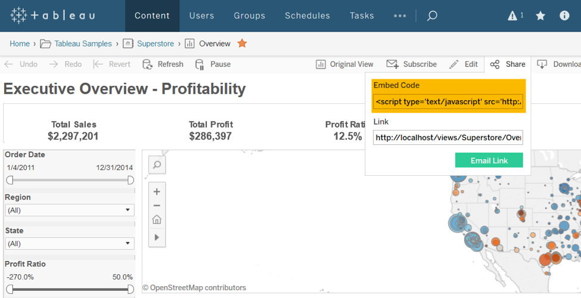
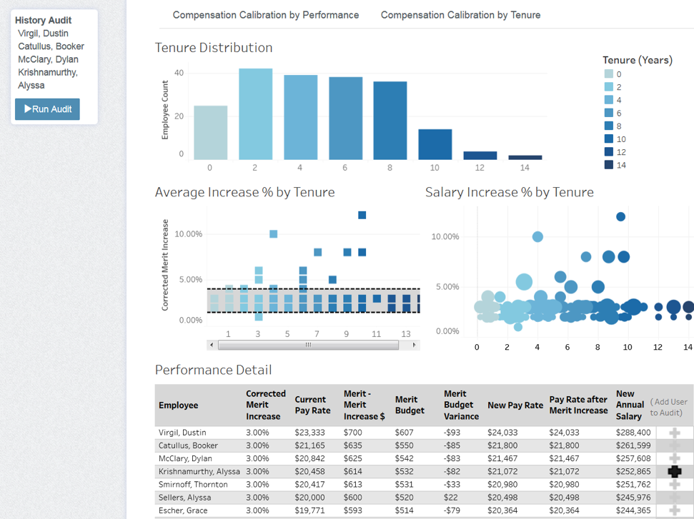

# Embedding Views & JavaScript API Usage

The easiest method for embedding a Tableau view (dashboard or visualization) is with the copy-paste embed code. Navigate to a view on Tableau Server and copy the Embed Code from the Share toolbar option.



Once acquired, this code can be pasted into HTML.
This method is useful for simple embedding, such as embedding into blogs or internal knowledge bases, but **only very simple embedding scenarios should use the embed code. Most deployments should instead use the JavaScript API**

## Embedding with the JavaScript API:

The basic embed code using the JavaScript looks something like:

HTML:
```html
<script src="https://www.example.com/javascripts/api/tableau-2.js"></script>
...
<div id="tableauViz"></div>
```
JavaScript:
```javascript
function initializeViz() {
  var placeholderDiv = document.getElementById("tableauViz");
  var url = "http://public.tableau.com/views/WorldIndicators/GDPpercapita";
  var options = {
    width: '600px',
    height: '600px',
    hideTabs: true,
    hideToolbar: true,
  };
  viz = new tableau.Viz(placeholderDiv, url, options);
}      
```

## Use cases for the JavaScript API
After embedding with the JavaScript API, you have unlocked its capabilities which are crucial for integrating with the front-end of your application. The possibilities with the JavaScript API are effectively infinite, but common use cases are:

**Filtering and setting parameters on load** -- The options object gives you a clean interface for filtering the visualization as it loads. This is useful for loading the viz with the correct context given where the user is in your application or choices they have made.
Note: Filtering with the JavaScript API is **not** a security mechanism. If you wish to have tamper-proof filters applied, you should use [user filters or database security](pages/04_multitenancy_and_rls.md).

**Custom interfaces for interacting with the view** -- Dashboards often have elements for filtering, changing parameters, and switching tabs, amongst other things. When integrating with another application, you may want to match the look and feel of dashboard interfaces with the look and feel of the embedding application. For example, you can create a drop-down with HTML/CSS/JS that matches the style of your application and have that drop-down make JavaScript API calls to filter the viz or change a parameter.

**Custom interactions** -- Because the JavaScript API gives you programmatic control over interaction, you can combine calls to create interactions that would not be possible otherwise. For example, you could create a button that switches to a specific visualization, changes a parameter, and then selects a set of marks all with a single click by the user. Or, when a user clicks a mark on a viz, you could have that drive a parameter change on another sheet. The combination of API calls is limited only by your imagination.

**Integration with other systems** -- If a visualization is embedded inside another system, and a user finds an insight from a visualization, it is likely the user will want to take action on that insight elsewhere in your application. With the JavaScript API, you can query data on the visualization, or listen to user events, and execute code that takes the appropriate action.

In the image below, an HR-focused dashboard allows the user to select employees for an audit. When the user is ready, he or she can click "Run Audit" to generate a non-Tableau audit based on the selections made inside the Tableau viz.



## JavaScript API Resources

Link | Description
---- | -----------
[JavaScript API Documentation](http://onlinehelp.tableau.com/current/api/js_api/en-us/JavaScriptAPI/js_api.htm#) | Official knowledge-base for the JavaScript API including an overview, tutorial, samples, explanation of key concepts, and API reference
[JavaScript API Tutorial](http://onlinehelp.tableau.com/samples/en-us/js_api/tutorial.htm) | An interactive tutorial that will walk you through the key concepts of the JavaScript API
[JavaScript API YouTube Playlist](https://www.youtube.com/watch?v=Geppur9LDnw&list=PL_qx68DwhYA8e_z9k7uoRw0zayoY35nUJ) | A series of youtube videos to get you up and running with the JavaScript API
[JavaScript API Samples](https://github.com/tableau/js-api-samples) | Official samples, created and maintained by Tableau


